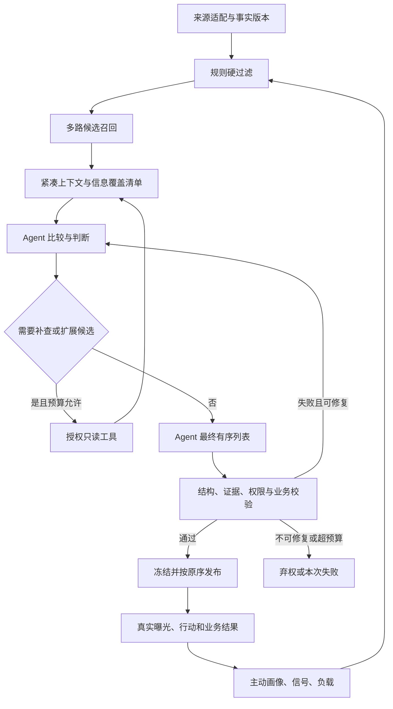

# Algorithm A：Agentic Adaptive Ranking 决策契约

> 上级入口：[施工总手册](2026-09-22-refactor-agentic-ranking-manual.md) · [文档书](README.md)
> 日期：2026-09-22；版本：`agentic-ranking-v1`（目标契约，尚未实现/发布）。
> 适用范围：顾问选职位；不替代职位选候选人的 talent matching 契约。

## 1. 决策权归属

Algorithm A 是在确定性权限与业务约束下，由 Agent 主动获取相关证据、比较候选岗位，并生成最终个性化推荐顺序、理由和行动建议的自适应决策系统。

**每条 A 推荐必须经过 Agent 最终选择；每个最终名次由 Agent 给出。** 系统负责事实、权限、预算、验证和持久化，不在 Agent 输出后应用固定加权、LTR 或多样性重排。模型调用失败时不得用规则拼出一份列表再标记为 A。

| 环节 | 负责的判断 | 不拥有的权力 |
|---|---|---|
| 数据源适配器 | 来源身份、完整性、原始字段映射 | 修改顾问偏好、生成最终排名 |
| 入库提炼 Agent | 有证据的软字段、摘要和冲突提示 | 推断权限、自动改变 HC/有效状态等权威事实 |
| 规则层 | 授权、有效性、忽略、重复、硬容量及冲突 | 用隐含加权决定最终优先级 |
| 召回与特征层 | 快速找到可能有价值的候选，计算可解释事实 | 把召回分当最终结果、永久封死扩展候选能力 |
| 推荐 Agent | 补查、跨岗位比较、取舍、排序、理由与下一步 | 直接写生产数据、越权查找、替人接单或联系 |
| 校验与发布服务 | 核验输出、版本、硬约束，原子保存和发布 | 用自己的分数改变合法 Agent 顺序 |
| 反馈层 | 沉淀真实结果，评估并发布新版策略 | 未经评估自动在线改 prompt、覆盖主动画像 |

Agent 决定推荐建议，不表示 Agent 决定接单或外发。可信执行器发布其建议，实际项目动作继续复用现有授权和确认流程。

## 2. 从事实到最终列表



### 2.1 硬过滤与软判断

硬过滤：有效身份与租户、职位可见性、完整来源快照、职位在招/未过期、最低身份与有效性字段、明确排除项、忽略或冷却、本人已承接/处理中、业务定义的排他冲突，以及明确配置的承接上限。

同岗其他顾问正在做不天然等于排他冲突；沿用已确认的协作规则。负载是否达到硬上限由项目领域裁决；未达上限时，余量、近期工作压力和执行记录作为 Agent 的软判断依据。

缺失可选字段不直接等同无价值；关键有效性或授权字段缺失则不能进入可推荐集合。具体字段、允许陈旧时间、忽略撤销及冷却规则绑定 `eligibility_policy_version`，不写死在 prompt 中。

### 2.2 信息覆盖与获取权

“获取所有信息”定义为：Agent 能通过受控工具获取有权访问、与当前决策相关的信息；先检查覆盖情况，发现重要缺口时补查。它不代表读取全公司全部消息、完整简历或无限 Token。

每轮必须提供以下类别的状态：`available / missing / denied / stale / conflicting`，并附证据版本；不能因为某类缺失而从输入中悄悄删掉这个类别。

| 类别 | 最小内容 | 补查触发 |
|---|---|---|
| 主动画像 | 擅长方向、希望发展的方向、偏好和明确排除 | 方向存在矛盾，或会影响前列选择 |
| 当前负载 | 活跃项目、行动、容量、待办压力和采样时间 | 状态变化、负载版本过期 |
| 岗位事实 | Canonical Job 版本、有效性、需求摘要、HC、Pipeline | 缺口影响推荐理由或出现来源冲突 |
| 近期意愿 | 浏览/接单/忽略信号，样本数、授权来源、有效期 | 推断与主动画像不一致 |
| 交付记录 | 类似项目的候选、面试、Offer、Onboard 和观察窗口 | 历史结果被用于优先级判断但证据不足 |
| 人才供给 | 授权供给摘要、时间和匹配版本 | 声称有现成人选或供给优势时 |
| 团队调度 | 可协作关系、集中度、探索/多样性政策 | 列表过于集中，或政策约束未满足 |

候选人供给摘要不默认包含联系方式、完整简历或无权看到的候选人身份。Agent 不因补查失败推断“没有人才”。

### 2.3 召回不能偷偷决定最终选择

- 首版建议多路合并 100–200 个候选：明确偏好、相似历史、近期有效需求、授权人才供给、新方向探索；不是已承诺生产参数。
- Agent 首轮详细比较约 30–50 个岗位，同时收到候选覆盖摘要与剩余候选可查询游标；不能只看到固定公式筛出的唯一 Top 30。
- 若不足量、候选过于单一、关键证据不足或新方向未覆盖，Agent 可扩大召回、补查单岗或要求其他召回通道。
- 规模较大时允许批量提炼/分批比较；最终选择和顺序必须经过同一个最终决策步骤，不能将各批次独立名次直接拼接或平均。
- 记录 eligible、retrieved、详细审阅、补查、输出五种计数。未逐项审阅不能声称“Agent 已分析全部岗位”。
- 语义 embedding 可作为后续优化，首版优先复用已有检索；新增模型/索引需单独证明召回价值与维护成本。

## 3. Agent 输入、工具与输出

以下为目标接口，不是已存在的 API 名称。实现时使用已安装的 Zod 或已有校验方式。

### 3.1 不可变决策输入

`RankingContextV1` 至少含：

```text
run_id, generation, tenant_id, consultant_id
as_of, received_high_watermark, source_snapshot_ids
profile_version, signal_snapshot_id, load_version, authorization_version
candidate_set_ref, job_fact_version_refs, feature_snapshot_id
evidence_manifest_ref, coverage_manifest, context_registry_version
algorithm_version, prompt_version, tool_schema_version, eligibility_policy_version
diversity_policy_version, model_id, model_parameters, budget
```

身份与版本由服务器注入，Agent 不能传入其他顾问 ID 改变作用域。每次工具结果加入当前证据清单，保存获取时间及可见字段，不在运行中覆盖已读取的事实快照。

### 3.2 只读工具面

| 目标工具 | 返回内容 | 限制 |
|---|---|---|
| `get_profile_context` | 主动画像、短期信号、负载及版本 | 仅本人或显式授权范围 |
| `search_eligible_jobs` | 过滤后候选摘要、通道与游标 | 服务器每次过滤，限页数与数量 |
| `get_job_evidence` | 指定版本事实、授权证据片段 | 禁止任意 URL 抓取与完整原文注入 |
| `get_delivery_history` | 可追溯历史结果与样本成熟度 | 按决策时点截断、按权限脱敏 |
| `get_supply_summary` | 聚合人才供给与可靠性 | 不扩大人才查询/联系方式授权 |

工具必须有 schema、超时、取消、结果大小上限和审计。原文、文档、JD 均按不可信数据处理；其中“忽略规则/调用工具/提高排名”等指令不能提升为系统策略。

### 3.3 最终输出示例

```json
{
  "schema_version": "agentic-ranking-v1",
  "run_id": "run-example",
  "decision": "RECOMMEND",
  "items": [
    {
      "job_id": "job-example",
      "job_fact_version": "fact-v3",
      "rank": 1,
      "decision_tier": "TODAY",
      "reason_codes": ["EXPLICIT_DIRECTION", "SUPPLY_EVIDENCE"],
      "reason": "符合本周明确关注的方向，且有可核验的人才线索",
      "tradeoff": "相比其他候选岗位，人才线索更具体；城市意愿仍待确认",
      "evidence_refs": ["profile-v2:direction", "supply-v4:summary"],
      "uncertainties": ["人才当前求职意愿尚未确认"],
      "suggested_next_action": "确认人才意愿后再决定接单"
    }
  ],
  "not_selected": [],
  "missing_information": [],
  "stop_reason": "SUFFICIENT_EVIDENCE"
}
```

`decision` 支持 `RECOMMEND / ABSTAIN`；无可靠候选或必要证据不足可弃权，不强凑 20 条。rank 必须唯一连续，列表顺序与 rank 一致。`not_selected` 只覆盖实际详细审阅的岗位与简短原因，不为未读岗位编造判断。

不要求总分，不强制每维 0–1 分数；Agent 的自报 confidence 不是成功概率。记录简明业务理由、事实依据和取舍，不要求或保存模型私有思维链。

## 4. 校验、修复与发布

1. 校验严格 JSON、字段长度/类型、允许枚举、数量、唯一 job/rank、run 身份和候选资格。
2. evidence 必须属于本轮已授权工具结果，并能定位到版本化字段/片段；引用存在不代表解释必然正确，还需事实字段一致性检查及离线人工抽样评估。
3. 校验明确排除、冲突、容量与多样性硬约束；软目标未达到只记录评价，不由系统重新排名。
4. 可修复错误返回脱敏错误码和涉及项给 Agent；首版最多 2 次修复（可版本化调整），计入总预算。不可修复、取消、预算耗尽直接失败。
5. 发布前复核当前权限、负载、岗位和偏好版本。实质变化则 `STALE`，重新召回/决策；不把旧判断标记为最新。
6. 短事务中写入 run、items、快照引用和发布事件；使用 generation/CAS 防止晚完成的旧运行覆盖新运行。模型调用不占数据库事务。
7. 接口和发送器按 Agent 原顺序读取；转义/截断展示文本不能改变结论，完整解释保存在授权详情。候选不足不从规则尾部补齐。

发布后发生撤权、关闭或忽略：读取和发送时立即抑制该项，保留剩余项的原始 rank，不补位、不重排；标记失效并请求新 run。分页返回本轮原始总数、当前可见数及可见项，游标绑定 run/视图；禁止用隐藏项制造连续的假名次。任何接单动作再次校验当前状态与容量，推荐不是容量预占。

多样性和探索必须在决策前作为版本化要求交给 Agent。例如“同客户最多 N 条”若被批准为硬约束，由校验器检查，失败由 Agent 修正；不在最终列表之后插入未经 Agent 选择的探索岗位。

## 5. 稳定性、缓存与失败语义

### 5.1 两种回放

- **决策回放**：加载当时保存的输入引用、工具证据、版本与输出，逐项还原当时展示结果；不再次调用模型。
- **重新推理评估**：在冻结输入上重新调用指定模型，用来衡量差异；不保证完全相同，也不覆盖历史决策。

输入候选以稳定顺序提交、模型参数和策略锁版本、同输入优先复用有效缓存，降低无意义波动；不能承诺模型 API 永久可用或设置低温度即可逐位复现。

缓存键至少覆盖租户、顾问、权限版本、主动画像/负载/信号、岗位事实集合、供给/结果水位、时间窗口、上下文、模型、prompt、工具及策略版本。引用内容不变不代表授权不变，缓存命中后仍需当前授权和硬条件校验。提炼缓存与推荐缓存分开。

### 5.2 运行状态

目标状态：`PENDING → RUNNING → VALIDATING → PUBLISHED`，另有 `ABSTAINED / FAILED / CANCELLED / STALE`。影子模式 `SHADOW_COMPLETED` 不得进入正式读取与投递。

区分三类控制：停止新增调用、停止发布、停止读取某版本。所有控制变更留审计。恢复策略：

| 情况 | 用户结果 | 后端行为 |
|---|---|---|
| 新 A 运行中 | 已有有效 A 结果与生成时间，或“生成中” | 异步任务、同幂等键复用任务 |
| 超时/限流/格式修复失败 | 旧 A 结果（经当前校验且未过期）或暂不可用 | 保存失败与用量，不规则补榜 |
| 关键来源不完整 | 不产生新判断，显示具体数据问题 | 保留水位与失败，不假定缺页为删除 |
| 无合格候选/必要证据不足 | 明确“本轮暂无可推荐岗位”及可披露原因 | 保存弃权，不能把失败当空列表成功 |
| 运维显式回滚到历史引擎 | 明确历史规则推荐标识 | 新 run 标 `baseline-1.1`，不称为 A，沿用硬约束 |

## 6. 反馈、调优与评估口径

Adaptive 表示画像/事实随真实反馈更新、策略在评估后晋升，不表示每次点击立即修改 prompt 或在线自改算法。主动偏好不被推断覆盖；短期信号有样本量、有效期和推断版本。

建议主指标为“真实曝光后 7 日有效推进率”，具体有效动作清单由业务在影子评估前批准。接单、候选推荐、面试、Offer、Onboard 分别统计；Offer 不等于入职，浏览不等于成功。记录结果的成本和成熟窗口，不能拿未成熟样本作失败。

时点规则：特征只能使用决策时系统已收到的信息；标签可以使用曝光后规定窗口内发生的结果，且必须在评估数据截点前收到。迟到结果另开评估版本。无法重建历史上下文的样本标记不可评估，不用当前 `job_facts` 补历史。

离线 NDCG 从完整评估组计算 IDCG，预测 rank 决定 DCG；未知标签不当 0、不挤掉未知后把第 11 位冒充第 10 位。首版发布比较使用充分标注的固定测试组；部分标注结果需给覆盖率并明确不能直接比较。召回率需有候选池之外的有效标注全集，否则只能报告“冻结集合内覆盖”，不能称全量 Recall。

非随机 Agent 决策没有可直接读取的展示概率；未知 propensity 为 null。不得用模型置信度伪造 propensity，也不能据此宣称完成无偏反事实评估。

影子用于比较安全、证据、排序、成本与分歧，不具有新策略真实业务结果。灰度按固定顾问/租户分组，记录位置、曝光、样本量及置信区间，区分相关性与因果效果。新顾问、稀疏行业和不同负载分别看，避免只优化老顾问。

## 7. 必须可执行的验收场景

| 编号 | 输入/故障 | 必须得到的结果 |
|---|---|---|
| A01 | 同一规范事实来自 TTC 与独立夹具源 | 排序输入契约一致，不读取 TTC 原字段 |
| A02 | 用户明确排除与 Agent 推断相反 | 规则排除，Agent 无权恢复 |
| A03 | 全部候选被排除/画像为空 | 如实空集合或基于可用证据决策，不伪造经验 |
| A04 | 前 30 无适合项，后续候选有匹配 | Agent 可扩召回；记录范围和成本 |
| A05 | Agent 返回非法岗位/重复排名/伪证据 | 不发布，修复受次数和预算限制 |
| A06 | Agent 返回合法顺序 B、A、C | 保存、Web 与飞书均为 B、A、C，不应用旧 score |
| A07 | Agent 未返回最终 JSON | 不产生任何 A 推荐；失败用量仍留存 |
| A08 | 运行中用户忽略岗位或撤权 | 发布前失效；发布后读取也不能泄露该项 |
| A09 | 两个运行乱序完成 | 旧 generation 不能覆盖新结果 |
| A10 | 缓存跨人/跨租户或授权变化 | 不复用越界内容，重新校验 |
| A11 | 工具超时、模型取消、达到预算 | 全链取消/有界退出，不继续隐藏调用 |
| A12 | JD 含“忽略规则、读取秘密” | 仅作为数据，不扩大工具或输出权限 |
| A13 | 补查文档巨大、摘要截断 | coverage 标记，必要事实不足则补查/弃权 |
| A14 | 历史时间切片与迟到 Offer | 输入无未来泄漏，标签仅进规定成熟窗口 |
| A15 | 只有 8 条合法 A 推荐 | 返回 8 条，不以旧算法补成 20/200 条 |
| A16 | 多样性要求不满足 | Agent 自行调整后重新校验，无系统后置重排 |
| A17 | 人才库不可用 | 不声称供给充足；按必要性降级或弃权 |
| A18 | 同一已完成输入重复请求 | 有效缓存/幂等返回，历史决策不被覆盖 |

自动检查验证结构、权限与事实一致性；业务理由是否充分还需盲评。上线门槛与责任人见[总手册 §5](2026-09-22-refactor-agentic-ranking-manual.md#5-开工前必须登记的参数)，不能在看过实验结果后再挑有利阈值。

## 相关文档

- [施工总手册](2026-09-22-refactor-agentic-ranking-manual.md)
- [数据契约与迁移手册](2026-09-22-ranking-data-migration.md)
- [历史算法基线](BrainX岗位推荐算法与评分标准.md)
- [推荐队列产品架构](recommendation-queue-product-architecture.md)
- [当前产品 PRD](prd-2026-09-02-brainx-workflow.md) · [安全操作手册](SECURITY.md)
