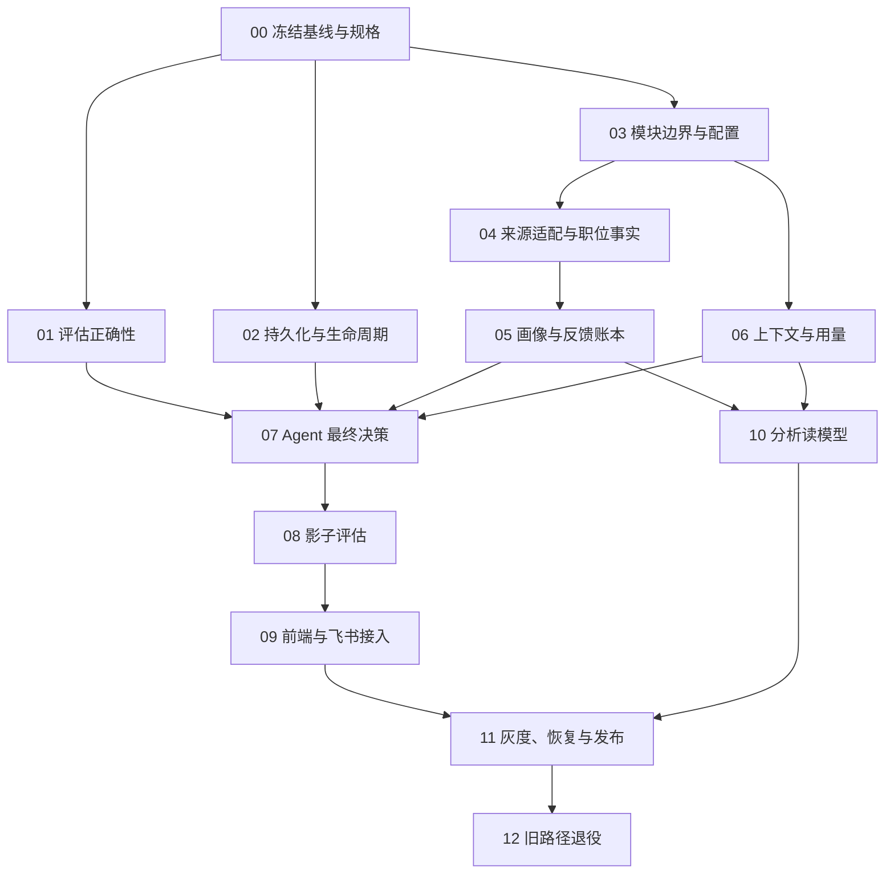

# BrainX 仓库重构与 Algorithm A 施工总手册

> 上级入口：[文档书总目录](README.md)
> 日期：2026-09-23；版本：施工设计 v1；状态：施工中，阶段 00 部分完成，阶段 01 已通过完整门禁，阶段 02 的持久化失败关闭、容量盘点、清理路径隔离及只读 dry-run 已通过完整门禁；阶段 03、04 已通过完整门禁。
> 配套：[Algorithm A 决策契约](2026-09-22-algorithm-a-contract.md) · [数据契约与迁移手册](2026-09-22-ranking-data-migration.md)

## 1. 目标、依据与权威范围

目标是把现有 BrainX 演进为可更换职位来源、可持续记录真实业务结果、由 Agent 最终决定个性化推荐的模块化单体。继续保留当前接单、建群、找人、跟进和 Offer 工作流；本轮文档交付不实施数据库迁移、业务改码或生产发布。

本手册负责本轮仓库重构的顺序、依赖和工程验收；配套算法契约负责 Algorithm A 的决策边界；配套数据手册负责新增数据及迁移。产品整体目标仍以[当前产品 PRD](prd-2026-09-02-brainx-workflow.md)为准；权限、Case、发送和人类确认继续遵守原有规范。

### 1.1 审计输入与本轮复核

用户提供的《BrainX 仓库与数据架构审计报告》，文件名 `brainx-architecture-audit.html`，报告标注时间为 2026-09-22 12:00 +08:00；本轮读取了 HTML 正文及同目录 `artifact.json`。不把个人磁盘路径或原始业务资料复制进仓库。

本轮代码复核基线：`6ae182be97c5dd054425eebc824137a142df3ba1`，分支 `codex/offer-single-report-sync`。报告所列数据库容量、表行数、历史门禁结果属于报告时点，本轮没有重测生产库或访问线上环境。报告里的 `audit/*` 等来源标识不是已核实存在的仓库文件，不能据此声称读过底层审计脚本。

| 审计项 | 本轮可复核代码 | 工程结论 |
|---|---|---|
| 正式推荐仍是固定评分 | `src/scorer.js` 的 `baseline-1.1`；`src/recommend.js` 调用 `scoreJob`、`sortRecs` | 需要增加独立 A 路径，不能只改权重或重写解释 |
| Python NDCG 索引错误 | `scripts/train_ltr.py` 的 `ndcg` 用枚举位置读取 `seg_l`，未使用排序索引 | 先修评估，否则无法评价新方案 |
| JS NDCG 理想序列范围错误 | `scripts/eval-ranking.mjs` 只从已截取 Top K 计算理想增益 | 从同组完整有效评估集合取理想 Top K；同时明确缺标签口径 |
| 历史特征和标签时点不完整 | `src/labels.js` 读取当前 engagement/outcome；评估脚本读取当前 `job_facts` | 特征冻结在决策时点，结果来自后续规定窗口，不得混用当前状态 |
| 忽略反馈未进入完整标签链 | `src/labels.js` 读旧反馈；`src/opportunity-ignore.js` 写持久忽略事实 | 统一忽略、撤销与业务原因，回放按事件时间取值 |
| 多轮模型用量未累计 | `src/agent/loop.js` 以新 `reply.usage` 覆盖前一轮 | 每次调用独立落账，run 聚合全部尝试 |
| 人才库自动内存回退 | `src/talent.js` 的 `backend()` 缺配置/断连返回 MEM | 生产必须显式失败，本地显式演示可保留 |
| 存在可复用基础 | `src/hub/*`、`src/integration-jobs/outbox.js`、`src/talent-pipeline/*` | 先核对契约和恢复语义，不能按审计建议再造一套 |
| 超限入口 | 本轮 `src/server.js` 为 625 行，`src/talent.js` 为 498 行 | server 功能改动前先拆分；人才库新增逻辑也优先独立模块 |
| 旧历史清理遗漏引用 | 原 `pruneRecommendationHistory` 与旧 retention apply 已隔离 | 只读盘点/规划已覆盖新引用；责任、恢复和执行器仍须另行验收 |

### 1.2 对原审计方案的修订

1. Algorithm A 正式定义为 **Agentic Adaptive Ranking**：Agent 获取授权范围内的相关信息并作出最终岗位选择、排序、理由与行动建议。
2. 固定加权与 LTR 仅保留为历史基线、召回辅助或离线对照；不能在 A 的最终输出之后重新排序。
3. 数据不足不意味着必须退回公式：Agent 可按明确画像和现有证据判断、补查或弃权；是否上线由评估证据决定。
4. A 失败时优先保留仍有效的旧 A 结果，或明确显示暂不可用；不自动把规则结果冒充 Agent 推荐。旧引擎恢复仅作为显式运维回滚，详见算法契约。
5. 沿用 Node、SQLite、MySQL 和已安装依赖；本方案不引入微服务、消息中间件、向量数据库或新的 Agent 框架，也不预设切换 PostgreSQL。

## 2. 不可削减的约束

- 顾问、租户及工具权限来自服务器可信身份；每次补查、发布、读取及接单均重新校验。
- 用户明确排除项高于推断偏好；关闭、过期、不可见、已承接和业务冲突不能靠 Agent 理由绕过。
- Agent 决策可以发布为建议；接单、联系候选人、发送消息和推进阶段仍走现有人的确认与领域动作。
- Agent 不拥有 SQL 写入、任意网络或生产修改工具。确定性服务校验后持久化决策，发送器忠实渲染其顺序和理由。
- 不变更原始身份、不丢失事件、不把未知变成零、不把发布计划写成上线事实。
- 单个物理工作区只允许一个写入者；沿用 [AGENTS.md](../AGENTS.md)、规格先行与每个手写文件 500 行限制。

## 3. 目标模块与渐进收口

目标依赖：`入口 → 用例 → 领域契约`；repository 和外部 adapter 实现契约，由启动组装层注入。跨领域访问通过公开接口或事件；路由、前端、Agent prompt 不读外部系统字段名。

以下目录是目标职责，不要求一次搬完。先在原路径建立边界、保留兼容导出；接口与行为测试通过后，逐领域迁入 `src/domains/<domain>/`。

| 目标领域 | 首批归属/复用入口 | 对外职责 |
|---|---|---|
| `identity-access` | `session.js`、`visibility.js`、`data-isolation.js`、`agent-gateway/authorization.js` | 可信身份、资源授权、权限版本 |
| `job-intelligence` | `sync.js`、`bridge.js`、`job-extract/`、`snapshot.js` | Canonical Job、证据、版本、来源完整性 |
| `project-execution` | `membership.js`、`engagement.js`、`commitment.js`、`projects.js` | 承接、负载、合法动作与业务结果 |
| `job-ranking` | `recommend.js`、`scorer.js`、`recommendation-page.js`、`labels.js` | 资格、召回、A 决策、冻结队列、评估 |
| `talent-matching` | `talent-pipeline/`、`talent-match-run.js`、`candidate-shortlist.js` | 人才匹配独立版本，向 A 提供授权供给摘要 |
| `agent-runtime` | `agent/loop.js`、`llm.js`、`personal-model-config.js` | 受控工具、上下文、模型调用、预算与用量 |
| `analytics` | 新增业务事件投影，复用 `hub/consumer.js` | 运营、效果、成本读模型 |
| `integrations` | `ttcsdk/`、`gateway/`、`integration-jobs/`、外部找人入口 | 外部协议、限流、游标和 outbox 投递 |

共享基础只保留连接、时间、ID、事务和配置；不得把所有 SQL 搬进一个巨型通用 repository。`hub/` 保留跨域事件协议，`worker_events` 仍是瞬态 relay，不作为分析真值。

配置先收口本轮涉及的来源、持久化模式、A 开关、模型、预算、版本和保留策略；启动时验证必填项与取值。模型配置与业务画像分开，密钥只保存引用。旧环境变量通过兼容映射迁移，不一次重命名全仓变量。

## 4. 施工依赖与交付方式

依赖图表示工程依赖，不授权多个 Agent 同时修改共享目录。每张任务卡按[规范驱动研发流程](standards/SPEC_DRIVEN_WORKFLOW.md)建立规格、方案和任务，编号在开工时核对现有 `specs/` 后分配，不在本手册预占迁移编号。

统一完成条件：可复核产物 + 有效回归检查 + 中文独立 commit + 提交记录。实现采用小步原子提交；代码重排、行为改变、数据迁移分开审查。涉及接口的“测试通过”不能代替目标环境验收。

### 00｜冻结基线与实施规格

- [ ] 记录 commit、工作锁、Git 状态、迁移清单、真实入口调用链和当前完整门禁；为脱敏数据库副本建立恢复点。
- [ ] 明确各阶段责任角色：工程负责人、业务验收人、数据负责人、运维负责人；姓名待项目分配，不沿用旧排期猜测。
- [ ] 输出接口兼容表、指标定义及本轮任务规格；关闭尚未实施的 A 开关。
- **验收**：旧推荐、忽略、接单/建群、找人、Offer 单报告的现有回归仍通过；备份可恢复。
- **回滚**：本阶段无业务变更；后续任务以冻结版本为参照，不 reset 他人代码。

### 01｜先修评估与标签

- [x] 修复 Python 排序索引与 JS IDCG 范围；核对 `evaluate({runs})` 使用局部参数而非全局常量；导出、影子与评估共享 `ranking-metrics-v2` 定义。
- [x] 把历史特征读取改为冻结快照；标签加入观察窗口、数据截点、收到时间和样本成熟度。
- [x] 接入忽略、撤销、未曝光、未成熟和未知；有互动不自动归因为本轮推荐贡献。
  - 进度：0053 追加式事件账本保存负反馈、原因更正和撤销；只有明确 `decision_id` 的窗口内反馈计入推荐标签，未关联的项目级忽略保持业务事实但不归因。
- **产物**：正确指标实现、手算对照夹具、时间切分数据字典和评估报告；入口 `scripts/train_ltr.py`、`scripts/eval-ranking.mjs`、`src/labels.js`、`bin/brainx-ltr-export.mjs`。
- **验收**：交换预测顺序指标随之改变；理想高价值项在 K 之外仍影响 IDCG；未来字段不进入输入；窗口内结果可作为标签；缺完整历史的样本明确排除。
- **回滚**：停止使用新评估报告作晋升依据，不恢复已证实错误的指标用于发布。

### 02｜生产持久化、增长与恢复

- [x] `src/talent.js` 按环境显式选择持久层；生产缺凭据、断连、表未就绪均失败，不能返回写入成功；建表归迁移账号。
  - 进度：运行期要求 `BRAINX_TALENT_BACKEND=mysql`，只读校验基础表与迁移历史；离线内存模式需双重显式开关且健康探针返回非零，生产预检拒绝未选择 MySQL。
- [x] 盘点 `ttc_field_reports`、`sync_runs`、限流跳过运行、推荐快照、原始上下文的体积、引用和保留责任。
  - 进度：新增 `retention-inventory-v1` 只读脱敏报告和责任矩阵；本地字段报告大字段约 122.8 MiB，旧清理路径遗漏新引用，所有类别因责任人、TTL 与恢复点未确认而禁止删除。
- [ ] 实现保留策略的 dry-run、分批归档/删除、停止开关、审计与失败恢复；先验证恢复再执行真实清理。
  - 进度：已停止推荐事务隐式裁剪并禁用旧 apply；`retention-plan-v1` 仅聚合推荐与节流候选，保护五类引用，缺最新 schema 即阻断，并已通过完整门禁。分批归档/删除、停止开关、删除审计与恢复仍未实现，因此本项保持未完成。
- **验收**：重启后确认过的写入仍存在；断网/磁盘不足/重复清理不丢事实；活跃回放和评估证据不被清理；恢复时重放删除标记。
- **回滚**：停清理、恢复连接或恢复已核验备份；不通过开启内存回退“恢复成功”。

### 03｜收口边界与配置

- [x] 先拆超限的 `src/server.js`，保持 HTTP 契约；为本轮触达模块建立 use case/repository 接口和依赖检查。
  - 进度：OAuth/session、人才库/人才供给和推荐路由均已迁入独立 route factory；`server.js` 从 625 行降至 455 行并移除超限例外。推荐编排已迁入无 SQL use case，SQLite 访问收进 repository，结构回归阻止入口直连旧实现和循环依赖；实现提交 `3df967e` 的完整门禁 25/25 通过。
- [x] 让 API、CLI、scheduler、worker 复用同一推荐用例；迁移期间保留旧导出，禁止重复一套业务状态机。
  - 进度：HTTP API、MCP、推荐/推送 CLI、worker bridge、自动推送和 scheduler 已统一组装 recommendation use case；`recommend.js` 只保留 21 行兼容 facade，既有配置集中校验并保持原变量与缺省值。后端 825/825、前端 53/53、Storybook 86/86 和卡片 18/18 通过，质量报告 Push 条件满足。
- **验收**：旧接口契约和关键回归通过；目标模块没有跨域 SQL、来源字段或循环依赖；新手写文件 ≤500 行。
- **回滚**：恢复兼容入口路由，数据结构不变；不同时改变规则与目录。

### 04｜来源适配与版本化职位事实

- [x] 先接 TTC 和一种独立的本地夹具/Excel CSV 来源，按[数据手册](2026-09-22-ranking-data-migration.md)落 source、映射、版本和字段证据。
  - 进度：已增加统一来源信封与 `0054` 追加迁移，TTC 和本地 CSV/fixture 均写入来源记录、不可变事实版本及逐字段证据；不完整分页不产生关闭语义。
- [x] 对群消息/JD 复用 `job-extract` 的草稿确认链；内容哈希未变不重复调用模型，软推断不能提升为权限/有效性事实。
  - 进度：群消息与私聊 JD 仍先进待确认草稿，人工确认后才经统一写入模块转正；LLM 提炼缓存按租户、群/顾问授权范围和内容/模型/prompt 版本隔离。
- [x] 建立单写权威、影子投影、增量补偿与对账；保持 `project_id`、membership、群和 Case 引用稳定。
  - 进度：来源同步和草稿确认共用 `job-fact-store`，来源冲突留痕；对账默认只读，显式补偿只恢复规范投影，不重编历史版本或关联 ID。实现提交 `a5a3dbd` 完整门禁 25/25 通过，后端 832/832、前端 53/53、Storybook 86/86、卡片 18/18 通过，Push 条件满足。
- **验收**：来源切换后，规范事实相同则下游输入等价；删除 TTC 字段依赖后测试仍可运行；分页中断不把缺页职位关停；冲突不静默覆盖。
- **回滚**：切回旧读路径并继续保存新版本与迁移游标；不 drop 新表或重建业务 ID。

### 05｜画像、曝光与结果闭环

- [x] 用户主动画像版本、短期推断信号与模型凭据分开；负载由项目领域实时提供。
  - 进度：主动画像按内容追加不可变版本且不包含模型凭据；短期信号支持来源、时间窗、到期和撤回，负载从承接与行动实时计算。
- [x] 复用 `decision_runs/recommendations/recommendation_impressions/decision_events/job_outcomes`，增加缺失版本和关联；记录真实曝光与动作来源。
  - 进度：已增加 served/visible 曝光事件账本，并把租户、Case、来源事件、更正及归因版本补入结果兼容投影。
- [x] 候选人、面试、Offer、Onboard 从权威事件接入，按 Case 去重、更正及归因；无可靠关联则标记未归因。
  - 进度：已由 workflow Case 事件幂等生成规范业务结果；更正只追加，且仅在决策、顾问和职位一致时显式归因。实现提交 `9875a5b` 完整门禁 25/25 通过，后端 836/836、前端 53/53、Storybook 86/86、卡片 18/18 通过，Push 条件满足。
- **验收**：重复消息只产生一次结果；多次曝光不重复算 Offer；忽略及撤销可按时点回放；未知不当失败；个人模型切换不改变主动画像。
- **回滚**：暂停新消费者，保留事件以重放；旧项目动作继续使用原权威写入口。

### 06｜Agent 上下文与完整用量

- [ ] 扩展 `agent/loop.js`、`llm.js` 的每轮记录，覆盖成功、失败、重试、取消、缓存命中；预算包含最后收尾和修复调用。
  - 进度：实现已完成，Agent loop 在每次模型请求前建账并记录终态，多轮/重试统一聚合；未知用量不补零，缓存与 reasoning 保留子集口径，强制收尾也消耗同一预算。待本阶段完整门禁后勾选。
- [ ] 上下文注册表记录来源、版本、授权、摘要、有效期和截断；群/文档映射先盘点再迁出硬编码。
  - 进度：已增加 Context Registry，保存来源版本、授权范围哈希、摘要、内容哈希、大小、有效期和截断；每次读取重验租户/作用域/过期/撤权，run 只关联引用。待本阶段完整门禁后勾选。
- [ ] 为 A 注册专用只读窄工具，不能直接复用拥有写能力的完整聊天工具集。
  - 进度：已为 A 建立严格五工具注册表，身份由服务端闭包注入，拒绝任意工具名、跨身份参数和不可见职位，并限制超时、取消与结果大小。待本阶段完整门禁后勾选。
- **验收**：两轮以上 usage 总和正确、缺失字段为 unknown；跨租户缓存不命中；工具取消生效；恶意 JD 指令不能触发工具越权或写数据。
- **回滚**：关闭 A 调用，保留已产生用量账本；上下文旧路径仅在原有权限边界内使用。

### 07｜Algorithm A 最小端到端链路

- [ ] 实现资格过滤 → 多路召回 → 信息覆盖清单 → Agent 补查/比较 → Agent 最终列表 → 校验 → 原子发布。
- [ ] 按[算法契约](2026-09-22-algorithm-a-contract.md)记录版本、预算、修复与弃权；首版完成 20 条以内即可，不用规则补齐 200 条。
- [ ] 发布临界区复核硬状态、版本与并发 generation；校验器不得另算总分或改变 Agent 顺序。
- **验收**：没有 A 最终输出不能产生 A 推荐；有效输出顺序逐项一致；越权、缺证据、重复、超时、并发失效都不发布；合法不足量如实返回。
- **回滚**：关闭新运行/发布开关，保留已保存且重新校验有效的旧 A 结果，否则明确不可用。

### 08｜离线、影子与效果证据

- [ ] 用相同授权、时点和候选池比较旧基线与 A；另做全链路召回覆盖评估，区分召回漏掉与 Agent 选错。
- [ ] 同一输入重复运行，测试候选顺序扰动、长文本、缺失画像、冷启动、来源冲突和恶意内容。
- [ ] 影子不投递、不计真实曝光，不用影子推测结果冒充真实转化。
- **验收**：硬约束违规为 0；效果、成本、延迟及分组偏差满足预先登记门槛；样本不足报告不确定性，不能全员发布。
- **回滚**：停止影子执行；保留评估快照、差异和模型版本。

### 09｜工作台与飞书忠实展示

- [ ] 服务端返回 `engine/run_id/rank/reason/evidence/uncertainties/generated_at`，前端以 A 顺序展示，不使用旧 score 二次排序。
- [ ] 旧六维权重控件不接 A；设置改为主动偏好、排除项和容量。旧分数仅在明确历史基线中显示。
- [ ] 冻结分页、异步生成、旧结果标记、无结果、失败恢复、权限撤销和动作幂等进入 Storybook/卡片场景。
- **验收**：同一 run 的数据库、API、Web、飞书展示一致；不把 200 候选写成 200 条已推荐；不能补造概率或理由。
- **审核**：遵守[前端审核台账](frontend-reviews/README.md)五状态；变更时同步台账、当轮记录、本施工任务和 Storybook 说明。当前编写手册不改变任何已有审核状态。
- **回滚**：恢复兼容读取/关闭 A 展示；旧接口不认识 A 时明确拒绝或路由到已标识的历史结果，不填假 score。

### 10｜运营、业务、效果与成本看板

- [ ] 由事件消费者产生读模型，不扫描在线原始大表；投影包含 checkpoint、更新时间、口径版本和租户范围。
- [ ] 展示同步新鲜度、失败/积压、容量增长、备份、真实漏斗、推荐分歧、成本/Token/延迟及样本成熟度。
- **验收**：抽样可从聚合回查事件；重复、乱序、更正和重建不会多算；影子与真实曝光分开；管理权限独立验证。
- **回滚**：暂停投影、重建读模型；不修改事实账本来“修平”看板。

### 11｜迁移切读、灰度与发布

- [ ] 执行[数据手册](2026-09-22-ranking-data-migration.md)切读流程；冻结 release manifest，绑定代码、schema、算法、prompt、工具、来源与权限策略版本。
- [ ] 按顾问/租户固定分组灰度，先内部授权试用，再逐步扩展；A 成本与队列隔离，防止挤占既有工作流。
- [ ] 完成断连、模型超时、worker 重启、outbox 崩溃窗口、备份恢复和容量峰值演练。
- **验收**：最新 commit 完整门禁通过；新旧数据无未解释差异；SLO 和业务指标达到已登记门槛；目标环境真实流程与撤权路径留证。
- **回滚**：按影响分别关闭模型调用、A 发布、A 读取；读回旧版本前先确认数据兼容和增量追平。若显式恢复旧引擎，界面与审计标记 `baseline-1.1`，不得标记 A。

### 12｜旧路径退役

- [ ] 灰度稳定且恢复窗口结束后，检查旧调用、定时任务、路由和数据引用均归零，再移除兼容层。
- [ ] 保留需要的历史回放解码器与审计记录；旧权重配置标记历史，不改写历史 run。
- **验收**：TTC adapter 是下游接触 TTC 字段的唯一边界；生产 A 不调用旧最终评分；旧 worker 停止写入且迁移恢复仍有记录。
- **回滚**：退役前保存版本与归档；破坏性删除单独评审，不与切读捆绑执行。

## 5. 开工前必须登记的参数

以下值影响上线，不影响先写规格、夹具和本地实现。未定时不得悄悄采用生产默认值。

| 参数 | 建议起点/处理方式 | 决定时点 |
|---|---|---|
| 业务主指标 | 建议使用 7 日有效推进；接单为前置信号，面试/Offer/Onboard 分别长期观察 | 08 前由业务确认窗口、分母和有效推进定义 |
| 运行规模 | 填顾问数、峰值并发、岗位数、变更率和推荐频次，不照搬审计工期 | 02 容量基线、11 压测前 |
| 响应与预算 | A 异步生成；单 run 金额、Token、轮次、工具数、截止时间均显式设限 | 06 首次真实模型调用前 |
| 保留与删除 | 按数据类别填 TTL、责任人、删除例外；未批准不自动删业务事实 | 02 清理写入前 |
| 业务冲突 | 同岗多人协作、负载上限、探索/多样性是否硬约束 | 05/07 前形成版本化配置 |
| 晋升门槛 | 安全违规 0；其余效果非劣界、成本、延迟、样本量预登记 | 08 实验开始前 |
| 数据库迁移范围 | 首版保持 SQLite/MySQL；公司级业务迁入既有 MySQL 的具体范围看压测与恢复结果 | 11 切库前；无需为 A 强制全库搬迁 |

排期按门禁推进。审计中的周数是估算，不能当作完成承诺；00 阶段盘点后为每张任务卡登记负责人、工作量和预计日期。

## 6. 验证与每次交接

开发期间运行 `npm run verify:quick`；每个任务增加能在错误实现上失败的最小检查。现有 `npm run eval:ranking` 在任务 01 完成前仅作旧快照诊断，不能作为 A 上线凭据。本手册没有新增可执行 CLI，文中目标接口和开关均需在相应任务落地后才能使用。

任务完成即更新中文日志并独立 commit；在该最新 commit 上运行 `npm run verify`。任何必需项目失败均不得 push；执行标准详见[上传前完整验证](standards/PRE_PUSH_VERIFICATION.md)。目标环境发布仍需单独记录环境和真实数据证据。

每张交接单填写：`任务 ID / 状态 / 负责人 / commit / 实际变更 / 验证命令与退出码 / 证据位置 / 未完成项 / 回滚点 / 下一依赖`。文档完成、代码完成、发布完成不能合并标记。

## 相关文档

- [Algorithm A 决策契约](2026-09-22-algorithm-a-contract.md)
- [数据契约与迁移手册](2026-09-22-ranking-data-migration.md)
- [当前产品 PRD](prd-2026-09-02-brainx-workflow.md) · [Workflow Hub](workflow-hub-architecture.md)
- [历史算法基线](BrainX岗位推荐算法与评分标准.md) · [旧交付蓝图](brainx-final-delivery-blueprint.md)
- [安全操作手册](SECURITY.md) · [前端审核台账](frontend-reviews/README.md)
